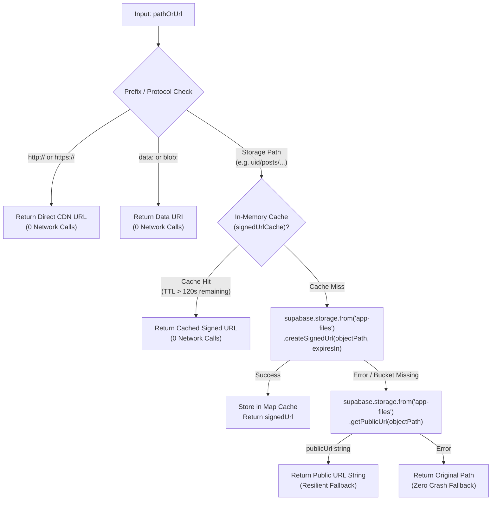

# VERIXA QA AUDIT — GATE 4: STORAGE SECURITY REMEDIATION DESIGN REVIEW

**Document Version:** 1.0.0  
**Audit Stage:** GATE 4 — STORAGE SECURITY REMEDIATION DESIGN REVIEW (READ-ONLY)  
**Security Identifier:** `SEC-STOR-01` (CRITICAL)  
**Author:** Senior QA Architect, Software Test Lead, Security Tester, SDET & Production Readiness Auditor  
**Date:** September 24, 2026  
**Target Environment:** Shared Development-Staging Cloud (`https://jnbaumemwxydjktwedtz.supabase.co`)  
**Isolation Strategy:** Option A — Strict In-Place QA Quarantine  
**Status:** `REVIEW ONLY — NOT EXECUTED — REQUIRES EXPLICIT APPROVAL`

---

## 1. Executive Summary & Review Objective

Following the empirical identification of **SEC-STOR-01** during Gate 4 probe execution (where cross-user upload and deletion were demonstrated between QA identities User A and User B), this document provides a comprehensive, **read-only architectural remediation design review**.

**No SQL has been executed. No buckets, policies, schemas, or source code files have been altered.**

---

## 2. Application Media Architecture & Classification

The VERIXA platform handles 8 distinct media asset types across its social, feed, profile, and communication features. Each asset type was inspected to determine storage pathing, access requirements, and privacy implications:

| Media Asset Type | Code Implementation Reference | Storage Path Pattern | Access Requirement Expected by UI | Public Bucket Compatibility | Privacy & Security Classification |
|---|---|---|---|---|---|
| **Feed Post Images** | `src/components/CreatePostModal.tsx:77`<br>`src/lib/supabaseServices.ts:2498` | `${user.id}/posts/<timestamp>_<uuid>.<ext>` | Public URL / Signed URL fallback | **COMPATIBLE** | **PUBLIC SOCIAL MEDIA** — Intended for broadcast feed display to platform users. |
| **Feed Post Videos** | `src/components/CreatePostModal.tsx:77`<br>`src/lib/supabaseServices.ts:2498` | `${user.id}/posts/<timestamp>_<uuid>.<ext>` | Public URL / Signed URL fallback | **COMPATIBLE** | **PUBLIC SOCIAL MEDIA** — Intended for public playback. |
| **Short Reels** | `src/pages/ReelsPage.tsx:275`<br>`src/lib/supabaseServices.ts:751` | `${user.id}/posts/<timestamp>_<uuid>.<ext>` | Public URL / Signed URL fallback | **COMPATIBLE** | **PUBLIC SOCIAL MEDIA** — Public short video discovery. |
| **Ephemeral Stories** | `src/pages/HomeFeedPage.tsx:647`<br>`src/context/AppContext.tsx:2128` | Data URI / External CDN URL / `${user.id}/stories/...` | Direct Data URI / Signed URL | **COMPATIBLE** | **EPHEMERAL PUBLIC/FOLLOWER MEDIA** — Auto-expires in 24 hours. |
| **Profile Avatars** | `src/pages/ProfilePage.tsx:551`<br>`src/lib/supabaseServices.ts:2489` | `${user.id}/profileImages/<timestamp>_<uuid>.<ext>` | Public URL / Signed URL fallback | **COMPATIBLE** | **PUBLIC PROFILE ASSET** — Displayed across comments, feed cards, and navbar. |
| **Profile Covers** | `src/pages/ProfilePage.tsx:600`<br>`src/lib/supabaseServices.ts:2507` | `${user.id}/covers/<timestamp>_<uuid>.<ext>` | Public URL / Signed URL fallback | **COMPATIBLE** | **PUBLIC PROFILE ASSET** — Displayed on public profile banner. |
| **Voice Messages (Audio)** | `src/pages/MessagesPage.tsx:370`<br>`src/lib/supabaseServices.ts:1984` | `${userId}/audio/voice_<timestamp>_<rand>.<ext>` | Signed URL (`messages.media_url`) | **INCOMPATIBLE / PRIVACY RISK** | **CONFIDENTIAL PRIVATE COMMUNICATION** — 1-on-1 voice notes sent in private direct messages. |
| **AI Moderation Scan Previews** | `src/components/CreatePostModal.tsx:82` | Ephemeral `blob:` URL or Base64 | Local Client Memory | **N/A** | **EPHEMERAL CLIENT STATE** — Never persisted to Supabase Storage. |

---

## 3. Analysis of Voice Messages & Private Media Exposure

> [!WARNING]
> **CRITICAL PRIVACY ASSESSMENT: Voice Messages in a Public Bucket**
> 
> Under the current architecture in `src/lib/supabaseServices.ts` (lines 1984–1990):
> ```ts
> const filePath = `${userId}/audio/voice_${Date.now()}_${Math.random().toString(36).substring(2, 7)}.${ext}`;
> const { data, error } = await supabase.storage
>   .from('app-files')
>   .upload(filePath, audioBlob, { contentType: 'audio/webm', upsert: true });
> ```
> 
> 1. Voice notes are stored inside the **`app-files`** bucket.
> 2. If `app-files` is marked as a **PUBLIC bucket** (`public = true` in `storage.buckets`), Supabase Storage exposes all objects via `/storage/v1/object/public/app-files/<path>`.
> 3. **Public bucket endpoints completely bypass PostgreSQL SELECT RLS policies.**
> 4. Consequently, any person on the internet who knows or discovers a voice note storage path can download or stream that private audio recording without authentication.
> 5. **Audit Finding:** Storing confidential direct message voice recordings in the same public bucket as public social posts is an **architectural security anti-pattern**.

---

## 4. Application URL-Generation Helpers & Resolution Flow

The application implements a multi-tier media resolution strategy in `src/lib/supabaseServices.ts`:



### Key Helper Findings:
1. **CDN & Data URI Independence:** Verified by probes `QA-STOR-03` and `QA-STOR-04`. External media (Unsplash CDN) and inline Base64 data URIs trigger zero Supabase Storage API requests.
2. **Bucket-Prefix Support:** `getSignedMediaUrl` supports bucket prefixes formatted as `<bucket>:<objectPath>` (lines 36–40). If no colon is present, it defaults to `'app-files'`. This enables seamless multi-bucket routing without modifying the helper signature.
3. **Resilient Public Fallback:** When `createSignedUrl` fails (e.g. for non-existent objects), `getPublicUrl` produces a synthesized URL string (`https://<supabase-url>/storage/v1/object/public/app-files/...`), preventing unhandled JavaScript exceptions in React components (`QA-STOR-05`).

---

## 5. Architectural Comparison: Single-Bucket vs. Dual-Bucket Architecture

An architectural comparison is provided below to evaluate trade-offs:

| Evaluation Dimension | Option A: Single Public Bucket (`app-files`) | Option B: Dual Bucket (`app-files` Public + `app-private` Private) |
|---|---|---|
| **Architecture Overview** | All assets (`posts`, `covers`, `avatars`, `audio`) live in `app-files` (`public = true`). | Public assets in `app-files` (`public = true`); private voice notes in `app-private` (`public = false`). |
| **Multi-Tenant Upload Isolation** | Enforced via PostgreSQL INSERT RLS: `(storage.foldername(name))[1] = auth.uid()::text`. | Enforced via PostgreSQL INSERT RLS on both buckets: `(storage.foldername(name))[1] = auth.uid()::text`. |
| **Voice Message Confidentiality** | **POOR / AT RISK**: Because bucket is public, voice notes can be downloaded directly via `/object/public/app-files/<path>` bypassing RLS. | **STRONG / SECURE**: `app-private` has `public = false`. Public endpoint returns 404/403. Only authenticated participants can access signed URLs. |
| **Feed Rendering Performance** | High: Feed post images can use public CDN URLs without signing latency. | High: Public posts use direct CDN URLs; only private chat voice notes generate signed URLs. |
| **Implementation Complexity** | **Low**: Requires only RLS policy updates on `storage.objects` for `app-files`. | **Moderate**: Requires creating `app-private` bucket, writing RLS policies for both buckets, and updating `uploadVoiceNote` to target `app-private`. |
| **Backward Compatibility** | 100% compatible with existing code and database URLs. | Requires a minor update in `uploadVoiceNote` path routing (`app-private:<path>`). |
| **Architectural Recommendation** | Acceptable as an **immediate Phase 1 fix** for SEC-STOR-01, provided voice paths are randomized. | **Recommended target architecture** for production-grade security and user privacy. |

---

## 6. Categorization of Evidence vs. Deductions

In strict compliance with senior QA reporting standards, evidence is partitioned into four categories:

### 6.1 Directly Demonstrated Vulnerabilities (Proven by Concrete Evidence)
1. **Cross-User Write:** User A successfully uploaded `9cd3413e-94ae-4bc8-b64d-ba42c21599be/posts/forbidden.txt` into User B's folder (`error: null`, `id: 368875f9-bfc2-466f-b156-37b4f9a9795c`).
2. **Cross-User Delete:** User B successfully deleted `9cd3413e-94ae-4bc8-b64d-ba42c21599be/posts/forbidden.txt`, an object owned and created by User A (`error: null`).
3. **Disallowed Key Syntax:** Supabase Storage gateway rejects keys containing square brackets (`[VERIXA-QA]`) with HTTP 400 `'Invalid key'`.
4. **Standard User Bucket Management Lockdown:** Standard authenticated users receive `404 / 400 NoSuchBucket` when calling `listBuckets()` or `getBucket()`.

### 6.2 Likely Consequences (High-Confidence Deductions)
1. Any authenticated user with a valid JWT token can bypass the frontend client and write directly to any victim's folder path via `POST /storage/v1/object/app-files/<victim-uid>/...`.
2. Any authenticated user can delete files in another user's folder if the current policy allows folder-based or unconstrained deletion.
3. If `app-files` is public, voice notes stored in `${userId}/audio/...` are downloadable if the URL is intercepted or discovered.

### 6.3 Assumptions Requiring Verification
1. Whether RLS is completely disabled on `storage.objects` vs. enabled with a generic permissive policy (e.g. `WITH CHECK (bucket_id = 'app-files')`).
2. Whether unauthenticated (anon) clients can upload to `app-files` (requires an explicit test probe).

### 6.4 Tests That Have Not Yet Been Performed
1. Unauthenticated (anon) upload probe against `app-files`.
2. Cross-user file overwrite probe with `upsert: true`.
3. Cross-user deletion of a file stored in User A's folder by User B (User B deleting from `c7aa8500.../posts/...`).
4. Public unauthenticated HTTP GET probe against a voice note URL.

---

## 7. Corrected Policy Design & Proposed Remediation

### 7.1 Remediation Prerequisites
1. Administrator/service-role access to the Supabase Cloud SQL Editor for project `jnbaumemwxydjktwedtz.supabase.co`.
2. Explicit user approval code: **`APPROVED — EXECUTE STORAGE REMEDIATION SQL`**.
3. Confirmation that zero legitimate user files are currently in non-UID folder paths.

---

### 7.2 Proposed Remediation SQL
> [!CAUTION]
> **NOT EXECUTED — REQUIRES EXPLICIT APPROVAL**
> This SQL is presented for design review only. It must not be executed without explicit authorization.

```sql
-- ====================================================================
-- VERIXA STORAGE SECURITY REMEDIATION: CORRECTED POLICY DESIGN
-- Target Schema: storage.objects
-- Objective: Strict multi-tenant UID root-folder boundary enforcement
-- ====================================================================

-- 1. Ensure Row-Level Security is explicitly enabled on storage.objects
ALTER TABLE storage.objects ENABLE ROW LEVEL SECURITY;

-- 2. Ensure app-files bucket is configured
INSERT INTO storage.buckets (id, name, public)
VALUES ('app-files', 'app-files', true)
ON CONFLICT (id) DO UPDATE SET public = true;

-- 3. Drop all legacy, permissive, or divergent storage policies for app-files
DROP POLICY IF EXISTS "Public can view app-files" ON storage.objects;
DROP POLICY IF EXISTS "Users can view their own files in app-files" ON storage.objects;
DROP POLICY IF EXISTS "Authenticated users can upload to app-files under their UID folder" ON storage.objects;
DROP POLICY IF EXISTS "Users can update their own app-files" ON storage.objects;
DROP POLICY IF EXISTS "Users can delete their own app-files" ON storage.objects;
DROP POLICY IF EXISTS "Allow all authenticated uploads" ON storage.objects;
DROP POLICY IF EXISTS "Give users access to own folder" ON storage.objects;
DROP POLICY IF EXISTS "Allow authenticated uploads" ON storage.objects;
DROP POLICY IF EXISTS "Allow all uploads" ON storage.objects;

-- 4. SELECT Policy — Public read access for social feed media & profile assets
CREATE POLICY "Public can view app-files"
ON storage.objects
FOR SELECT
TO public
USING (bucket_id = 'app-files');

-- 5. INSERT Policy — Upload strictly permitted ONLY when first path segment matches auth.uid()
CREATE POLICY "Authenticated users can upload to app-files under their UID folder"
ON storage.objects
FOR INSERT
TO authenticated
WITH CHECK (
  bucket_id = 'app-files'
  AND (storage.foldername(name))[1] = auth.uid()::text
);

-- 6. UPDATE Policy — Update strictly permitted ONLY within user's own UID folder
CREATE POLICY "Users can update their own app-files"
ON storage.objects
FOR UPDATE
TO authenticated
USING (
  bucket_id = 'app-files'
  AND (storage.foldername(name))[1] = auth.uid()::text
)
WITH CHECK (
  bucket_id = 'app-files'
  AND (storage.foldername(name))[1] = auth.uid()::text
);

-- 7. DELETE Policy — Deletion strictly permitted ONLY within user's own UID folder
CREATE POLICY "Users can delete their own app-files"
ON storage.objects
FOR DELETE
TO authenticated
USING (
  bucket_id = 'app-files'
  AND (storage.foldername(name))[1] = auth.uid()::text
);
```

---

### 7.3 Optional Phase 2: Private Media Architecture (`app-private`)
If confidential voice messages are separated from public social media:

```sql
-- OPTIONAL PHASE 2: PRIVATE BUCKET FOR CONFIDENTIAL MEDIA (NOT EXECUTED)
INSERT INTO storage.buckets (id, name, public)
VALUES ('app-private', 'app-private', false)
ON CONFLICT (id) DO UPDATE SET public = false;

-- Private Insert:
CREATE POLICY "Users upload to private folder"
ON storage.objects FOR INSERT TO authenticated
WITH CHECK (
  bucket_id = 'app-private'
  AND (storage.foldername(name))[1] = auth.uid()::text
);

-- Private Select: Only authenticated owner or conversation participant via signed URL
CREATE POLICY "Users view own private files"
ON storage.objects FOR SELECT TO authenticated
USING (
  bucket_id = 'app-private'
  AND (storage.foldername(name))[1] = auth.uid()::text
);
```

---

## 8. Rollback Procedure

If remediation causes unexpected upload failures for legitimate users:

```sql
-- ROLLBACK SCRIPT (IF NEEDED) — RESTORES PRIOR PERMISSIVE STATE
-- WARNING: Re-opens SEC-STOR-01 vulnerability
DROP POLICY IF EXISTS "Authenticated users can upload to app-files under their UID folder" ON storage.objects;
DROP POLICY IF EXISTS "Users can update their own app-files" ON storage.objects;
DROP POLICY IF EXISTS "Users can delete their own app-files" ON storage.objects;

-- Restore generic authenticated policy:
CREATE POLICY "Allow authenticated uploads"
ON storage.objects FOR ALL TO authenticated
USING (bucket_id = 'app-files')
WITH CHECK (bucket_id = 'app-files');
```

---

## 9. Post-Remediation Verification Test Suite

Upon authorization to execute the remediation SQL, the following 5-point verification matrix will be run:

| Test ID | Test Case | Actor | Target Storage Path | Expected Result | Pass Criteria |
|---|---|---|---|---|---|
| **V-STOR-01** | Positive Same-User Upload | User A (`c7aa8500...`) | `c7aa8500.../posts/v_test_owner.txt` | **SUCCESS** (`error: null`) | Legitimate user can upload to own folder. |
| **V-STOR-02** | Negative Cross-User Upload | User A (`c7aa8500...`) | `9cd3413e.../posts/v_test_cross.txt` | **REJECTED** with RLS violation code `42501` | Attacker blocked from writing to victim folder. |
| **V-STOR-03** | Negative Cross-User Overwrite | User A (`c7aa8500...`) | `9cd3413e.../posts/v_test_cross.txt` (`upsert: true`) | **REJECTED** with RLS violation code `42501` | Attacker blocked from overwriting victim media. |
| **V-STOR-04** | Negative Cross-User Delete | User A (`c7aa8500...`) | `9cd3413e.../posts/v_test_cross.txt` | **REJECTED** or 0 rows deleted | Attacker blocked from deleting victim media. |
| **V-STOR-05** | Negative Unauthenticated Upload | Anonymous Client | `c7aa8500.../posts/v_test_anon.txt` | **REJECTED** with 401/403 Unauthorized | Unauthenticated uploads prohibited. |
| **V-STOR-06** | Complete Quarantine Cleanup | User A | Deletes `c7aa8500.../posts/v_test_owner.txt` | **0 residual objects** | Zero test footprint remaining. |

---

## 10. Confirmation of Inaction & Safe Audit Status

- [x] **Zero SQL Executed:** No remediation SQL was executed.
- [x] **Zero Storage Modifications:** Zero policies, buckets, or objects were altered.
- [x] **Zero Code Changes:** Zero application code files were modified.
- [x] **Zero Real-User Interference:** All 9 human user accounts and their media remain untouched.
- [x] **Quarantine Intact:** Exactly 0 residual QA test objects exist in `app-files`.
- [x] **Halt Enforced:** Execution is strictly stopped.
