# VERIXA Platform — Complete UML System Specifications & Architectural Diagrams

> **Project:** VERIXA AI-Safe Social Media Platform & Neural Defense Architecture  
> **Repository:** `khabir-278/verixa`  
> **Specification Standard:** Unified Modeling Language (OMG UML 2.5)  
> **Generation Date:** 2026-09-08  

---

## Table of Contents

1. [Executive Architectural Overview](#1-executive-architectural-overview)
2. [Structural UML Diagrams](#2-structural-uml-diagrams)
   - [2.1 High-Level Component Diagram](#21-high-level-component-diagram)
   - [2.2 Modular Package Diagram](#22-modular-package-diagram)
   - [2.3 Detailed Domain & Service Class Diagram](#23-detailed-domain--service-class-diagram)
   - [2.4 Database Entity-Relationship Diagram (ERD / Logical Data Model)](#24-database-entity-relationship-diagram-erd--logical-data-model)
   - [2.5 Deployment & Cloud Infrastructure Diagram](#25-deployment--cloud-infrastructure-diagram)
3. [Behavioral UML Diagrams](#3-behavioral-uml-diagrams)
   - [3.1 System Use Case Diagram](#31-system-use-case-diagram)
   - [3.2 Sequence Diagram 1: Content Publishing & AI Moderation Gateway Pipeline](#32-sequence-diagram-1-content-publishing--ai-moderation-gateway-pipeline)
   - [3.3 Sequence Diagram 2: Behavioral Safety & AI Guardian Risk Engine](#33-sequence-diagram-2-behavioral-safety--ai-guardian-risk-engine)
   - [3.4 Sequence Diagram 3: Moderation Appeal & Human-in-the-Loop Review Queue](#34-sequence-diagram-3-moderation-appeal--human-in-the-loop-review-queue)
   - [3.5 Sequence Diagram 4: Personalized Feed Recommendation & Transparent Explainability](#35-sequence-diagram-4-personalized-feed-recommendation--transparent-explainability)
   - [3.6 Activity Diagram: End-to-End Content Ingestion & Multi-Tier Verification Pipeline](#36-activity-diagram-end-to-end-content-ingestion--multi-tier-verification-pipeline)
   - [3.7 State Machine Diagram 1: Content Moderation Lifecycle](#37-state-machine-diagram-1-content-moderation-lifecycle)
   - [3.8 State Machine Diagram 2: User Guardian Risk Level & Adaptive Restrictions](#38-state-machine-diagram-2-user-guardian-risk-level--adaptive-restrictions)
   - [3.9 State Machine Diagram 3: Moderation Review & Appeal Lifecycle](#39-state-machine-diagram-3-moderation-review--appeal-lifecycle)
4. [Subsystem Mapping Matrix](#4-subsystem-mapping-matrix)

---

## 1. Executive Architectural Overview

VERIXA is an end-to-end, AI-defended social platform engineered around **zero-tolerance digital safety, transparent feed recommendation, and multi-signal behavioral risk management**. 

The system architecture is bifurcated into:
- **Client Tier**: A responsive single-page application built on **React 19**, **TypeScript**, **Tailwind CSS 4**, and **Lucide/Motion** components, communicating with backend micro-services via REST and Supabase Realtime subscriptions.
- **Server Tier**: An Express.js and TypeScript runtime exposing specialized engines:
  1. **Centralized AI Moderation Gateway** (`ModerationGateway`)
  2. **Multilingual & Script Analyzer** (`languageDetector`, `aiAnalyzer`)
  3. **Media Safety & Deepfake Detector** (`mediaAnalyzer`, `videoSafetyEngine`, `gifExtractor`)
  4. **Behavioral Safety Suite** (Cyberbullying, Spam, Fake Account Heuristics, Privacy Scanner)
  5. **AI Guardian Mode Engine** (`guardianService`)
  6. **Human Review & Appeals System** (`reviewService`)
  7. **Personalized Feed Recommendation Engine** (`feedService`, `TransparentHeuristicRanker`, `MLRecommendationRanker`)
  8. **Sentinel AI Chatbot Assistant** (`GoogleGenAI` integration)
- **Data Tier**: **Supabase (PostgreSQL 15+)** with Row-Level Security (RLS), real-time replication, storage buckets, database triggers, and synchronized fallback local JSON event ledgers.

---

## 2. Structural UML Diagrams

### 2.1 High-Level Component Diagram

This diagram captures the physical and logical boundaries of VERIXA's subsystem components, inter-component interfaces, and external API dependencies.

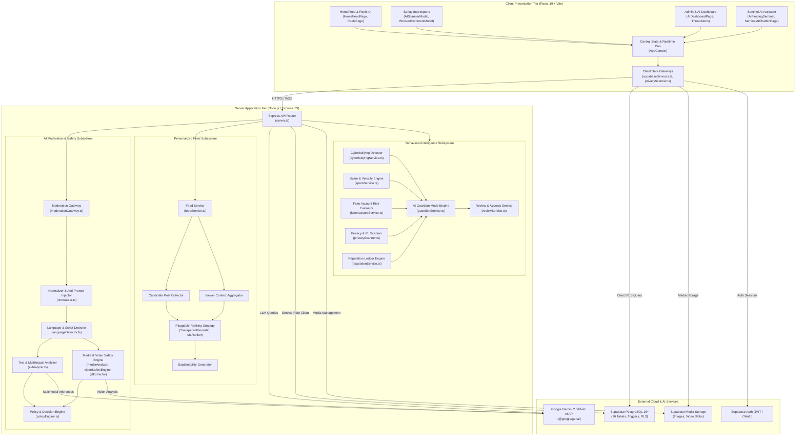

---

### 2.2 Modular Package Diagram

This diagram displays the structural organization of source code packages, module boundaries, and dependency hierarchies.

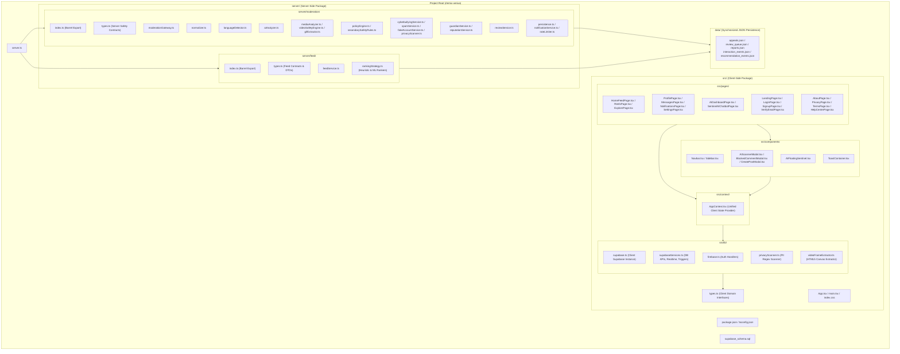

---

### 2.3 Detailed Domain & Service Class Diagram

This class diagram depicts the domain entities, safety records, controllers, and core services with their properties, method signatures, and associations.

```mermaid
classDiagram
  direction TB

  %% Domain Entities
  class User {
    +string id
    +string username
    +string name
    +string avatar
    +string bio
    +boolean verified
    +string aiTrustBadge
    +number safetyScore
    +number followersCount
    +number followingCount
    +number postsCount
    +string role
    +string createdAt
  }

  class Post {
    +string id
    +User user
    +string caption
    +string mediaUrl
    +string mediaType
    +number likes
    +number shares
    +string timestamp
    +string[] tags
    +string category
    +number aiSafetyScore
    +AIScanDetails aiScanDetails
    +RecommendationExplainability explainability
  }

  class Comment {
    +string id
    +string postId
    +User user
    +string content
    +string timestamp
    +number toxicityScore
    +string[] categories
    +string aiStatus
    +number likes
  }

  class Story {
    +string id
    +User user
    +string mediaUrl
    +string type
    +string timestamp
    +boolean viewed
    +boolean isAIModerated
    +number viewsCount
    +string[] viewedBy
    +number likesCount
    +string expiresAt
  }

  class Reel {
    +string id
    +User user
    +string caption
    +string videoUrl
    +string audioTitle
    +number likes
    +number commentsCount
    +string aiTrustBadge
    +number deepfakeRisk
    +string moderationStatus
  }

  %% Moderation & Behavioral Entities
  class NormalizedModerationResponse {
    +string decision
    +boolean allowed
    +string status
    +string state
    +string content_type
    +string language
    +string[] categories
    +number toxicity_score
    +number confidence
    +number risk_score
    +string reason
    +string safe_rewrite
    +string analysis_id
    +MediaInspectionScores scores
  }

  class GuardianScoreRecord {
    +string id
    +string user_id
    +number guardian_score
    +string risk_level
    +number confidence
    +GuardianExplainability explainability
    +string[] allowed_actions
    +string last_calculated_at
  }

  class UserRestrictionRecord {
    +string id
    +string user_id
    +string risk_level
    +boolean upload_restricted
    +boolean comment_restricted
    +boolean messaging_restricted
    +boolean account_suspended
    +number upload_cooldown_seconds
    +number comment_cooldown_seconds
    +string appeal_status
  }

  class AppealRecord {
    +string id
    +string user_id
    +string analysis_id
    +string content_id
    +string content_type
    +string original_decision
    +string reason
    +string appeal_text
    +string status
    +string admin_decision
    +string admin_id
  }

  class ReviewQueueItem {
    +string id
    +string item_type
    +string reference_id
    +string content_id
    +string user_id
    +string priority
    +number risk_score
    +string category
    +string status
    +string claimed_by
  }

  %% Services & Engines
  class ModerationGateway {
    +moderate(input: ModerationRequestInput) Promise~NormalizedModerationResponse~
    +getEvents(limit: number) ModerationEventRecord[]
  }

  class GuardianService {
    -Map userEvents
    -Map userScores
    -Map userRestrictions
    -Map appeals
    -number SLIDING_WINDOW_MS
    +getRiskLevel(score: number) GuardianRiskLevel
    +getAllowedActionsForTier(riskLevel: GuardianRiskLevel) string[]
    +recordEvent(input: RecordGuardianEventInput) Promise~GuardianScoreRecord~
    +getGuardianScore(userId: string) Promise~GuardianScoreRecord~
    +getUserRestrictions(userId: string) Promise~UserRestrictionRecord~
    +checkUserAction(userId: string, action: string) Promise~CheckResult~
    +fileAppeal(userId: string, text: string, reason: string) Promise~GuardianAppealRecord~
    +resolveAppeal(appealId: string, status: string, reviewerId: string) Promise~GuardianAppealRecord~
  }

  class CyberbullyingService {
    -InteractionRecord[] interactions
    -CyberbullyingEvent[] events
    +recordInteraction(data: object) InteractionRecord
    +analyzeBullyingPatterns(targetUserId: string, actorUserId: string) BullyingAnalysisResult
    +getBullyingEventsForUser(userId: string) CyberbullyingEvent[]
  }

  class SpamService {
    -Map userActionHistory
    -hashContent(text: string) string
    -computeSimilarity(textA: string, textB: string) number
    +checkSpam(userId: string, content: string, type: string) SpamCheckResult
  }

  class FakeAccountService {
    +evaluateAccountRisk(factors: object) FakeAccountRiskEvaluation
  }

  class ReviewService {
    +submitAppeal(input: SubmitAppealInput) Promise~AppealRecord~
    +fileReport(input: FileReportInput) Promise~ReportRecord~
    +enqueueQuarantineItem(analysisId: string, contentId: string, type: string) ReviewQueueItem
    +getReviewQueue(filters: object) Promise~ReviewQueueItem[]~
    +resolveReviewQueueItem(id: string, adminId: string, action: string) Promise~ReviewQueueItem~
    +decideAppeal(appealId: string, decision: string, adminId: string) Promise~AppealRecord~
    +getAdminDashboardStats() Promise~AdminDashboardMetrics~
  }

  class FeedService {
    -FeedRankingStrategy currentStrategy
    -FeedScoringWeights weights
    +getPersonalizedFeed(viewerId: string, options: object) Promise~RankedFeedResult~
    +recordInteraction(event: object) Promise~InteractionEventRecord~
    +getExplainability(postId: string, viewerId: string) Promise~RecommendationExplainability~
    +getWeights() FeedScoringWeights
    +setWeights(weights: object) FeedScoringWeights
  }

  class TransparentHeuristicRanker {
    +id: string
    +name: string
    +version: string
    +rank(candidates: PostCandidate[], context: ViewerContext, weights: FeedScoringWeights) Promise~RankedPostItem[]~
    -computeRecencyScore(createdAt: string) number
    -computeEngagementScore(candidate: PostCandidate) number
  }

  %% Relationships
  User "1" -- "*" Post : authors
  Post "1" -- "*" Comment : contains
  User "1" -- "*" Comment : creates
  User "1" -- "*" Story : publishes
  User "1" -- "*" Reel : uploads
  User "1" -- "1" GuardianScoreRecord : possesses
  User "1" -- "0..1" UserRestrictionRecord : constrained_by
  User "1" -- "*" AppealRecord : initiates
  
  ModerationGateway ..> NormalizedModerationResponse : outputs
  ModerationGateway ..> ReviewService : auto-enqueues QUARANTINE
  GuardianService ..> GuardianScoreRecord : calculates
  GuardianService ..> UserRestrictionRecord : enforces
  CyberbullyingService ..> GuardianService : reports signals
  SpamSvc ..> GuardianService : reports signals
  FakeAcctSvc ..> GuardianService : reports signals
  ReviewService ..> AppealRecord : resolves
  ReviewService ..> ReviewQueueItem : triages
  ReviewService ..> GuardianService : applies restitution
  FeedService ..> TransparentHeuristicRanker : executes strategy
  FeedService ..> Post : ranks & serves
```

---

### 2.4 Database Entity-Relationship Diagram (ERD / Logical Data Model)

VERIXA utilizes a PostgreSQL 15 schema managed via Supabase (`supabase_schema.sql`), with 26 dedicated tables enforcing strict referential integrity, automated denormalization counter triggers, and audit logging.

```mermaid
erDiagram
  PROFILES {
    uuid id PK
    text username UK
    text name
    text email
    text avatar
    text bio
    text role
    boolean verified
    integer safety_score
    text ai_trust_badge
    integer followers_count
    integer following_count
    integer posts_count
    timestamptz created_at
    timestamptz updated_at
  }

  POSTS {
    uuid id PK
    uuid user_id FK
    text caption
    text media_url
    text media_type
    text[] hashtags
    integer likes_count
    integer comments_count
    text visibility
    text moderation_status
    integer ai_safety_score
    jsonb ai_scan_details
    timestamptz created_at
    timestamptz updated_at
  }

  COMMENTS {
    uuid id PK
    uuid post_id FK
    uuid user_id FK
    text text
    integer toxicity_score
    text moderation_status
    timestamptz created_at
  }

  LIKES {
    uuid id PK
    uuid post_id FK
    uuid user_id FK
    timestamptz created_at
  }

  FOLLOWS {
    uuid id PK
    uuid follower_id FK
    uuid following_id FK
    timestamptz created_at
  }

  SAVED_POSTS {
    uuid id PK
    uuid user_id FK
    uuid post_id FK
    timestamptz created_at
  }

  STORIES {
    uuid id PK
    uuid user_id FK
    text media_url
    text media_type
    text moderation_status
    text analysis_id
    integer views_count
    uuid[] viewed_by
    integer likes_count
    timestamptz created_at
    timestamptz expires_at
  }

  REELS {
    uuid id PK
    uuid user_id FK
    text caption
    text video_url
    text audio_title
    integer likes_count
    integer comments_count
    text ai_trust_badge
    integer deepfake_risk
    text moderation_status
    timestamptz created_at
  }

  MESSAGES {
    uuid id PK
    text conversation_id
    uuid sender_id FK
    uuid receiver_id FK
    text text
    text media_url
    boolean is_ai_verified
    timestamptz created_at
  }

  NOTIFICATIONS {
    uuid id PK
    uuid recipient_id FK
    uuid sender_id FK
    text type
    uuid post_id FK
    text message
    boolean read
    timestamptz created_at
  }

  REPORTS {
    uuid id PK
    uuid reporter_id FK
    text target_id
    text target_type
    text reason
    text description
    text severity
    text status
    uuid resolved_by FK
    timestamptz resolved_at
    timestamptz created_at
  }

  MODERATION_LOGS {
    uuid id PK
    text analysis_id UK
    uuid user_id FK
    text target_id
    text target_type
    text decision
    text status
    integer toxicity_score
    integer confidence
    text[] categories
    text reason
    text language
    jsonb metadata
    timestamptz created_at
  }

  GUARDIAN_SCORES {
    uuid id PK
    uuid user_id FK,UK
    numeric score
    text risk_level
    numeric confidence
    jsonb explainability
    jsonb signals_summary
    timestamptz last_calculated_at
    timestamptz updated_at
  }

  GUARDIAN_EVENTS {
    uuid id PK
    uuid user_id FK
    text event_type
    text severity
    numeric impact
    numeric confidence
    text source
    text reason
    jsonb metadata
    timestamptz created_at
  }

  USER_RESTRICTIONS {
    uuid id PK
    uuid user_id FK,UK
    text risk_level
    boolean upload_restricted
    boolean comment_restricted
    boolean messaging_restricted
    boolean account_suspended
    integer upload_cooldown_seconds
    integer comment_cooldown_seconds
    text appeal_status
    timestamptz created_at
    timestamptz updated_at
  }

  MODERATION_APPEALS {
    uuid id PK
    uuid user_id FK
    text analysis_id
    text content_id
    text content_type
    text original_decision
    text reason
    text appeal_text
    text status
    text admin_decision
    uuid admin_id FK
    timestamptz created_at
    timestamptz resolved_at
  }

  REVIEW_QUEUE {
    uuid id PK
    text item_type
    text reference_id
    text content_id
    text content_type
    uuid user_id FK
    text priority
    integer risk_score
    text category
    text status
    uuid claimed_by FK
    timestamptz created_at
    timestamptz updated_at
  }

  ADMIN_ACTIONS {
    uuid id PK
    uuid admin_id FK
    text action_type
    text target_type
    text target_id
    uuid affected_user_id FK
    text reason
    numeric guardian_adjustment
    numeric reputation_adjustment
    timestamptz created_at
  }

  USER_INTERACTION_EVENTS {
    uuid id PK
    uuid user_id FK
    uuid post_id FK
    text interaction_type
    integer dwell_time_ms
    jsonb metadata
    timestamptz created_at
  }

  SERVED_RECOMMENDATION_EVENTS {
    uuid id PK
    uuid user_id FK
    uuid post_id FK
    integer rank_position
    numeric total_score
    jsonb scoring_factors
    text model_version
    timestamptz served_at
  }

  %% Entity Relationships
  PROFILES ||--o{ POSTS : "authors"
  PROFILES ||--o{ COMMENTS : "writes"
  POSTS ||--o{ COMMENTS : "contains"
  PROFILES ||--o{ LIKES : "creates"
  POSTS ||--o{ LIKES : "receives"
  PROFILES ||--o{ FOLLOWS : "follower"
  PROFILES ||--o{ FOLLOWS : "following"
  PROFILES ||--o{ SAVED_POSTS : "saves"
  POSTS ||--o{ SAVED_POSTS : "saved_by"
  PROFILES ||--o{ STORIES : "publishes"
  PROFILES ||--o{ REELS : "uploads"
  PROFILES ||--o{ MESSAGES : "sends"
  PROFILES ||--o{ MESSAGES : "receives"
  PROFILES ||--o{ NOTIFICATIONS : "receives"
  PROFILES ||--o{ REPORTS : "files"
  PROFILES ||--o{ MODERATION_LOGS : "triggers"
  PROFILES ||--o{ GUARDIAN_SCORES : "maintains"
  PROFILES ||--o{ GUARDIAN_EVENTS : "logs"
  PROFILES ||--o{ USER_RESTRICTIONS : "subject_to"
  PROFILES ||--o{ MODERATION_APPEALS : "submits"
  PROFILES ||--o{ REVIEW_QUEUE : "subject_of"
  PROFILES ||--o{ ADMIN_ACTIONS : "affected_by"
  PROFILES ||--o{ USER_INTERACTION_EVENTS : "emits"
  POSTS ||--o{ USER_INTERACTION_EVENTS : "target_of"
  PROFILES ||--o{ SERVED_RECOMMENDATION_EVENTS : "receives"
  POSTS ||--o{ SERVED_RECOMMENDATION_EVENTS : "served_in"
```

---

### 2.5 Deployment & Cloud Infrastructure Diagram

This diagram displays the execution topologies, runtime containers, hardware nodes, network boundaries, and secure protocols connecting VERIXA's distributed services.

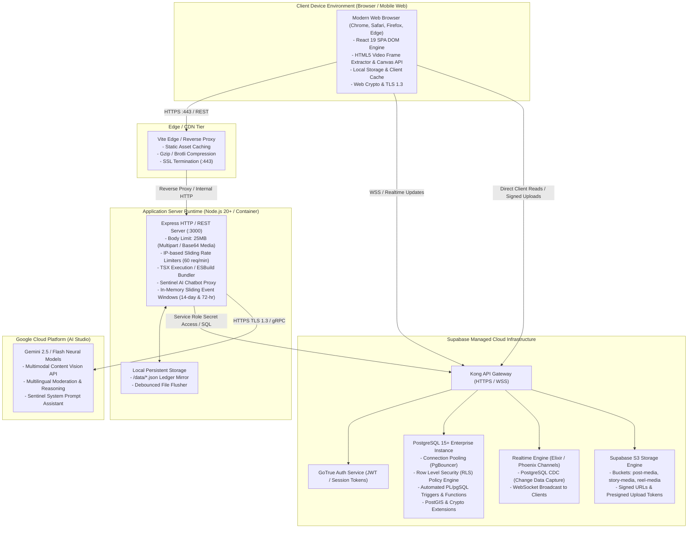

---

## 3. Behavioral UML Diagrams

### 3.1 System Use Case Diagram

This diagram visualizes the behavioral interactions between system actors (**Regular User**, **Authenticated User**, **Content Creator**, **Moderator/Admin**, and **Sentinel AI Sentinel**) and the primary platform use cases.

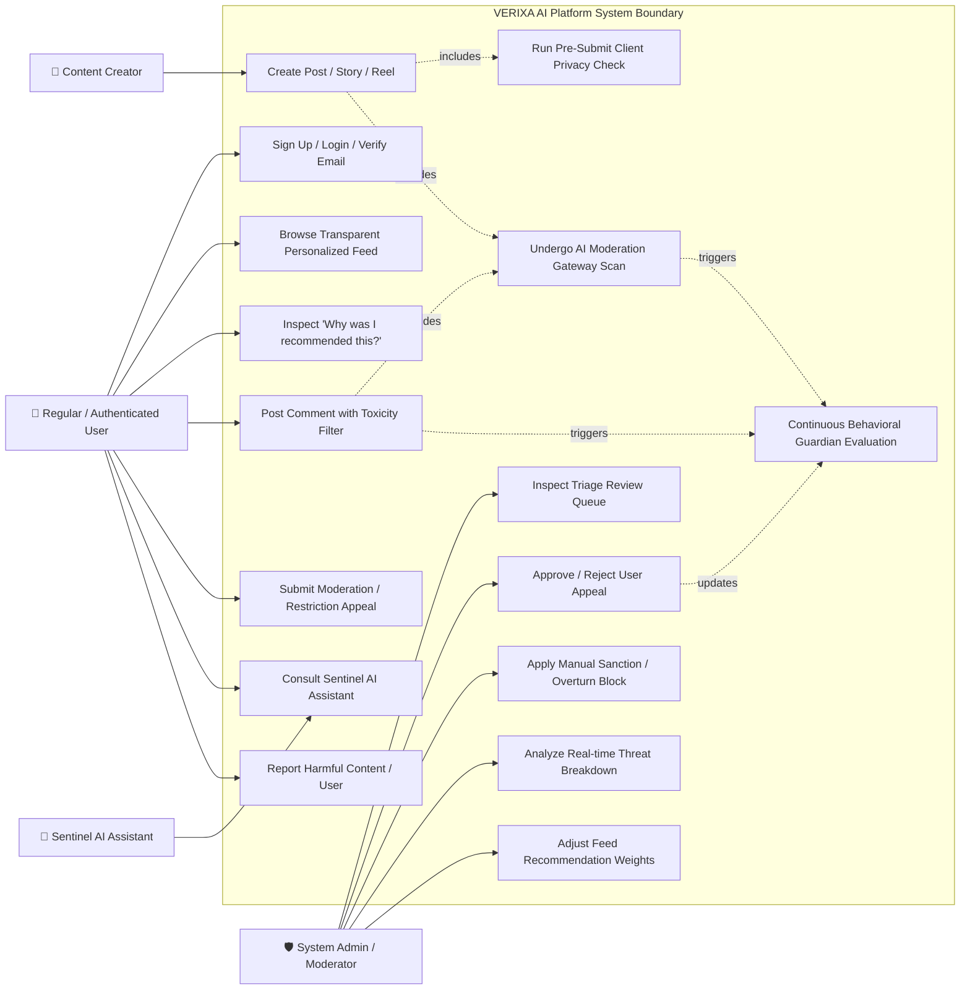

---

### 3.2 Sequence Diagram 1: Content Publishing & AI Moderation Gateway Pipeline

This diagram traces the exact synchronous execution sequence of a user publishing content through the 10-step AI Moderation Gateway.

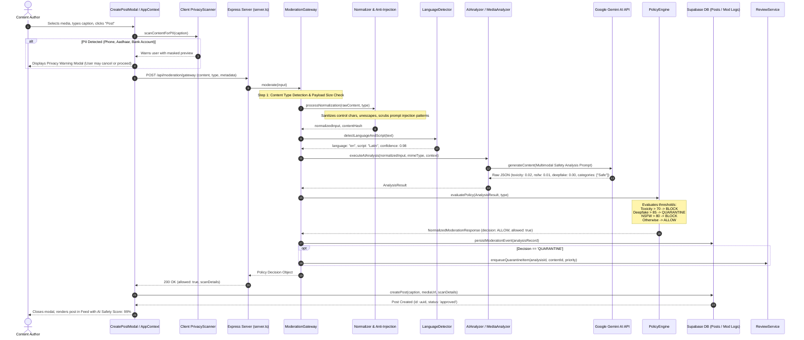

---

### 3.3 Sequence Diagram 2: Behavioral Safety & AI Guardian Risk Engine

This diagram illustrates how multi-source signals (toxicity, cyberbullying, spam, fake account heuristics) are captured and evaluated to dynamically recalculate a user's Guardian Risk Level and enforce automated rate limits or cooldowns.

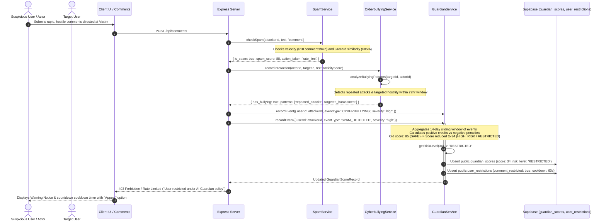

---

### 3.4 Sequence Diagram 3: Moderation Appeal & Human-in-the-Loop Review Queue

This diagram maps the lifecycle of a user appeal against a flagged post or account restriction, progressing through triage, admin adjudication, and automated score restitution.

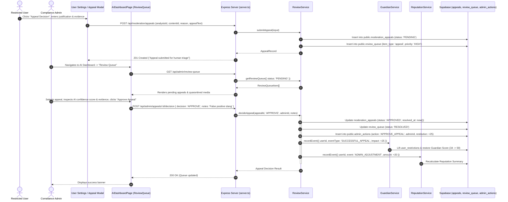

---

### 3.5 Sequence Diagram 4: Personalized Feed Recommendation & Transparent Explainability

This diagram illustrates how VERIXA provides transparent algorithmic recommendation, calculating multi-factor ranking weights and generating explainable insights for every post served.

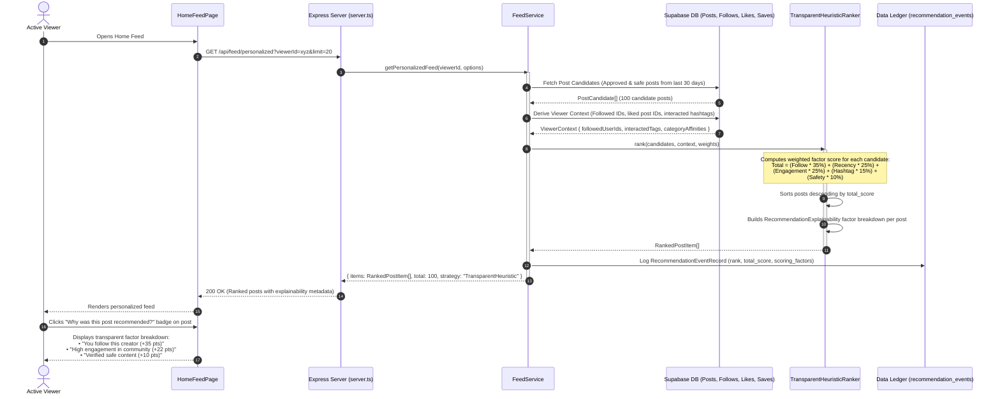

---

### 3.6 Activity Diagram: End-to-End Content Ingestion & Multi-Tier Verification Pipeline

This activity flowchart details the decision nodes, branching conditions, and concurrency involved in publishing user-generated content.

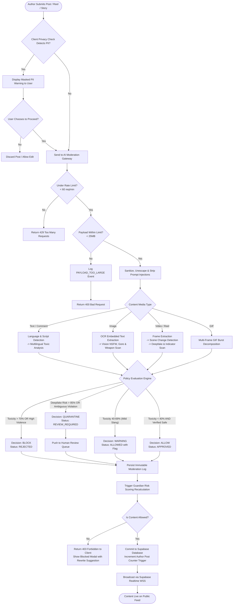

---

### 3.7 State Machine Diagram 1: Content Moderation Lifecycle

This state machine models the authoritative status transitions of any post, comment, reel, or story submitted to VERIXA.

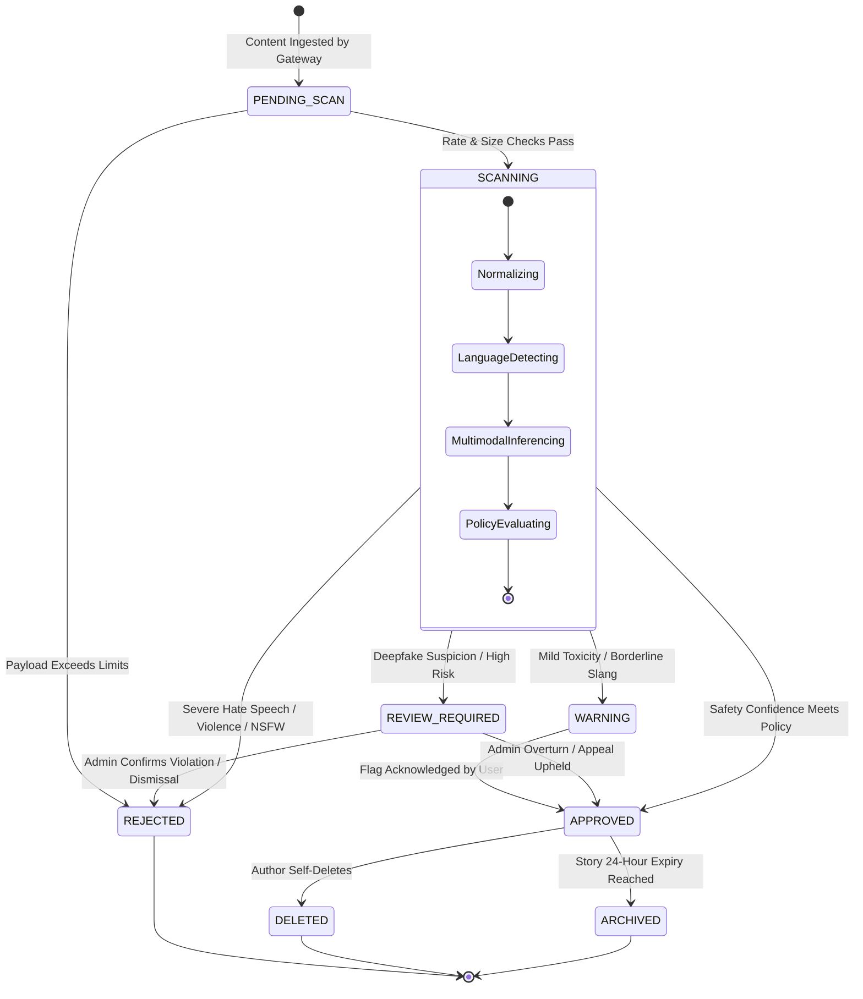

---

### 3.8 State Machine Diagram 2: User Guardian Risk Level & Adaptive Restrictions

This state machine models the behavioral tier transitions of a user under the **AI Guardian Mode Engine**, detailing the actions permitted at each tier and the recovery pathways.

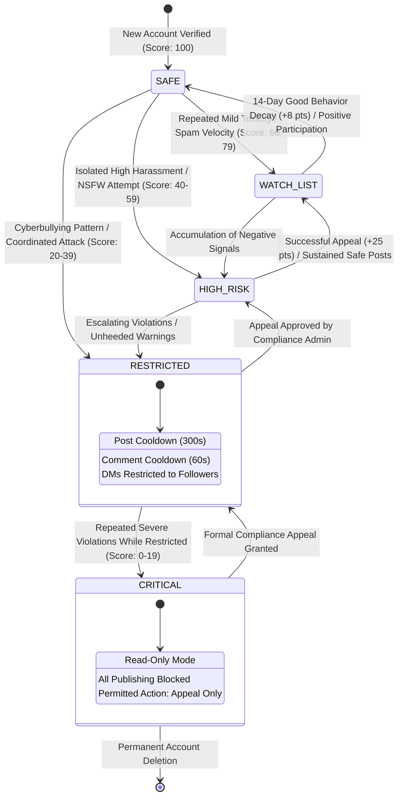

---

### 3.9 State Machine Diagram 3: Moderation Review & Appeal Lifecycle

This state machine traces the lifecycle of user appeals and review queue items from creation through human-in-the-loop triage and final disposition.

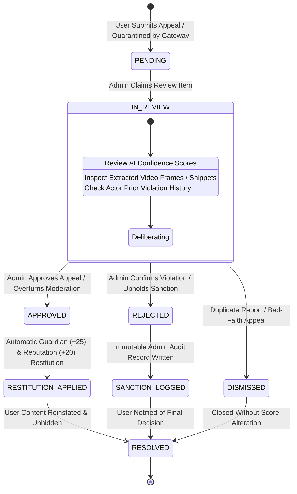

---

## 4. Subsystem Mapping Matrix

The following matrix provides a reference mapping across VERIXA's primary architectural subsystems, their implementation files, database tables, and corresponding UML diagrams:

| Subsystem | Key Implementation Files | Supabase DB Tables | Primary UML Reference |
| :--- | :--- | :--- | :--- |
| **AI Moderation Gateway** | `server/moderation/moderationGateway.ts` `server/moderation/normalizer.ts` `server/moderation/languageDetector.ts` | `public.moderation_logs` | **Diagram 2.1, 2.3, 3.2, 3.6, 3.7** |
| **Media Safety & Vision** | `server/moderation/mediaAnalyzer.ts` `server/moderation/videoSafetyEngine.ts` `server/moderation/gifExtractor.ts` | `public.posts`, `public.reels`, `public.stories` | **Diagram 2.1, 2.3, 3.6** |
| **Policy & Decision Engine** | `server/moderation/policyEngine.ts` `server/moderation/secondarySafetyRules.ts` | `public.moderation_logs` | **Diagram 2.3, 3.2, 3.6, 3.7** |
| **AI Guardian Risk Engine** | `server/moderation/guardianService.ts` | `public.guardian_scores` `public.guardian_events` `public.user_restrictions` | **Diagram 2.3, 2.4, 3.3, 3.8** |
| **Behavioral Intelligence** | `server/moderation/cyberbullyingService.ts` `server/moderation/spamService.ts` `server/moderation/fakeAccountService.ts` | `public.cyberbullying_events` `public.spam_events` | **Diagram 2.1, 2.3, 3.3** |
| **Privacy & PII Defense** | `server/moderation/privacyScanner.ts` `src/lib/privacyScanner.ts` | Transient / Masked Logs | **Diagram 2.1, 3.2, 3.6** |
| **Human Review & Appeals** | `server/moderation/reviewService.ts` `src/pages/AIDashboardPage.tsx` | `public.moderation_appeals` `public.review_queue` `public.admin_actions` `public.reports` | **Diagram 2.3, 2.4, 3.4, 3.9** |
| **Transparent Feed Engine** | `server/feed/feedService.ts` `server/feed/rankingStrategy.ts` `src/pages/HomeFeedPage.tsx` | `public.user_interaction_events` `public.served_recommendation_events` | **Diagram 2.1, 2.3, 2.4, 3.5** |
| **User & Social Core** | `src/context/AppContext.tsx` `src/lib/supabaseServices.ts` | `public.profiles`, `public.posts` `public.comments`, `public.likes` `public.follows`, `public.messages` | **Diagram 2.1, 2.2, 2.3, 2.4** |
| **Sentinel AI Assistant** | `server.ts` (`/api/ai-assistant`) `src/components/AIFloatingSentinel.tsx` `src/pages/SentinelAIChatbotPage.tsx` | Gemini API Session / Transient | **Diagram 2.1, 2.5, 3.1** |

---
*End of VERIXA Unified Modeling Language (UML 2.5) System Specifications.*
